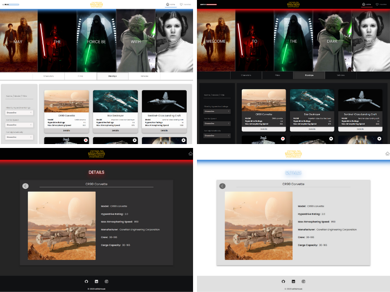
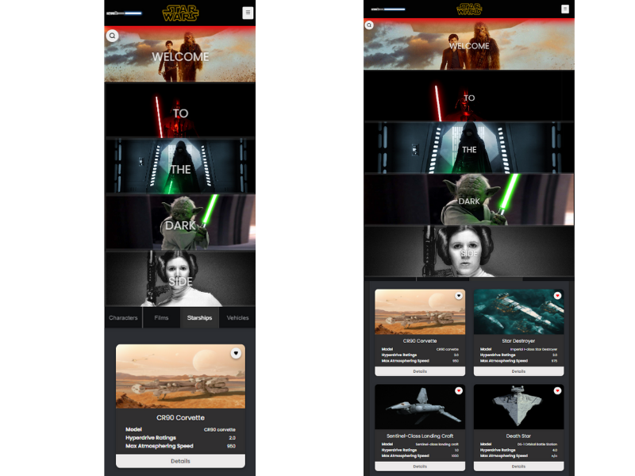

# Fmss Bilişim - Patika.dev Final Case

<p align="center">

  <br/>

</p>

## 🌍 Live

[Click To Review](https://fmss-front-end-final-case.vercel.app/)

## 📌 Features

- Search for Name / Model /Title
- Sort by Speed
- Sort Alphabetically
- Filter by Hyperdrive Ratings
- Categories
- Detail Page
- Add to Favorites
- Load More
- Responsive Design

## 💻 Built with

Technologies used in the project:

- React
- React Router DOM
- Redux Toolkit
- Axios
- TypeScript
- Sass
- React Icons
- React Content Loader

## Project View

[Project presentation video](https://www.loom.com/share/e978314e6aaf417d8df21dfd437c821e)

## 🛠️ Installation Steps

1. This project uses the [Star Wars API (SWAPI)](https://swapi.dev/)

2. Clone the repo

```sh
git clone https://github.com/atifsimsek/FMSS-front-end-final-case
```

3. Install NPM packages

```sh
npm install
```

4. Run the project

```sh
npm run dev
```

## Thanks

Thank you to the FMSS IT and Patika team, as well as everyone involved, for their contributions in preparing this Practicum.

## Project screenshots


<br/>

